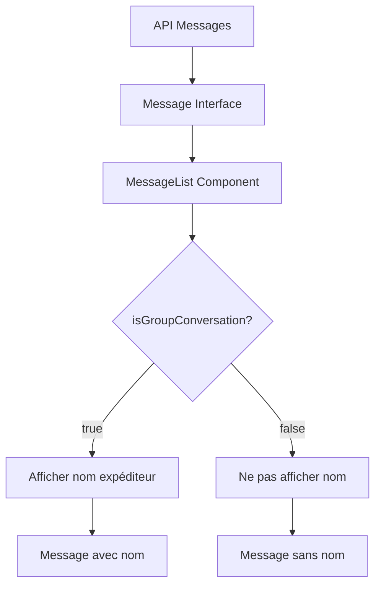

# Identification des Expéditeurs dans les Conversations de Groupe

## Problème Résolu

Dans les conversations de groupe, il était impossible d'identifier qui avait envoyé chaque message, car seul le contenu du message était affiché.

## Solution Implémentée

### 1. Modification du Composant MessageList

**Fichier :** `src/components/dashboard/messaging/message-list.tsx`

- **Nouvelle prop :** `isGroupConversation?: boolean`
- **Fonction ajoutée :** `getSenderDisplayName()` pour formater le nom de l'expéditeur
- **Affichage conditionnel :** Le nom de l'expéditeur s'affiche uniquement pour les conversations de groupe et pour les messages des autres utilisateurs

### 2. Mise à Jour des Composants Utilisateurs

**GroupConversationView :**

```typescript
<MessageList
  messages={messages}
  currentUserId={user?.uid}
  isLoading={messagesLoading}
  onDeleteMessage={deleteMessage}
  isGroupConversation={true} // Toujours true pour les conversations de groupe
/>
```

**ConversationView :**

```typescript
<MessageList
  messages={messages}
  currentUserId={user?.uid}
  isLoading={messagesLoading}
  onDeleteMessage={deleteMessage}
  isGroupConversation={conversation?.type === "GROUP"} // Détection automatique
/>
```

## Flux de Données



## Structure des Données

### Interface Message (déjà existante)

```typescript
interface Message {
  id: string;
  conversationId: string;
  senderId: string;
  content: string;
  attachments?: any;
  createdAt: Date;
  sender: {
    uid: string;
    firstname: string | null;
    lastname: string | null;
    profileImage: string | null;
  };
}
```

### Fonction de Formatage

```typescript
const getSenderDisplayName = (message: Message) => {
  if (!message.sender) return "Utilisateur";

  const { firstname, lastname } = message.sender;
  const fullName = `${firstname || ""} ${lastname || ""}`.trim();

  return fullName || "Utilisateur";
};
```

## Comportement

### Conversations de Groupe

- ✅ Affiche le nom de l'expéditeur pour les messages des autres utilisateurs
- ✅ N'affiche pas le nom pour ses propres messages (évite la redondance)
- ✅ Utilise le nom complet (prénom + nom) ou "Utilisateur" par défaut

### Conversations Privées

- ✅ N'affiche pas le nom de l'expéditeur (pas nécessaire avec seulement 2 personnes)
- ✅ Maintient l'affichage existant

## Avantages

1. **Clarté :** Les utilisateurs peuvent facilement identifier qui a envoyé chaque message
2. **Cohérence :** Le comportement s'adapte automatiquement au type de conversation
3. **Performance :** Aucun impact sur les performances, utilise les données déjà récupérées
4. **Maintenabilité :** Code propre et bien structuré avec des fonctions utilitaires
5. **UX :** Améliore l'expérience utilisateur dans les conversations de groupe

## Tests

Pour tester l'implémentation :

1. Créer une conversation de groupe avec plusieurs utilisateurs
2. Envoyer des messages depuis différents comptes
3. Vérifier que les noms des expéditeurs s'affichent correctement
4. Vérifier que les conversations privées n'affichent pas les noms
