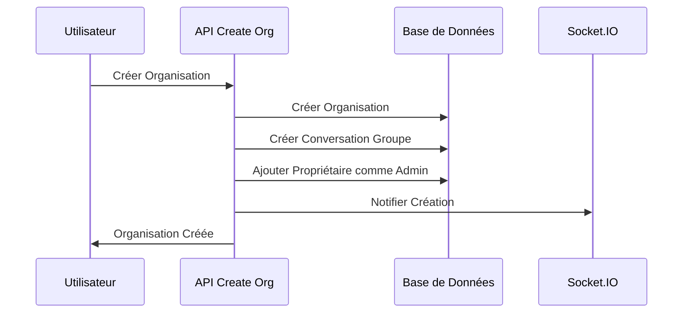
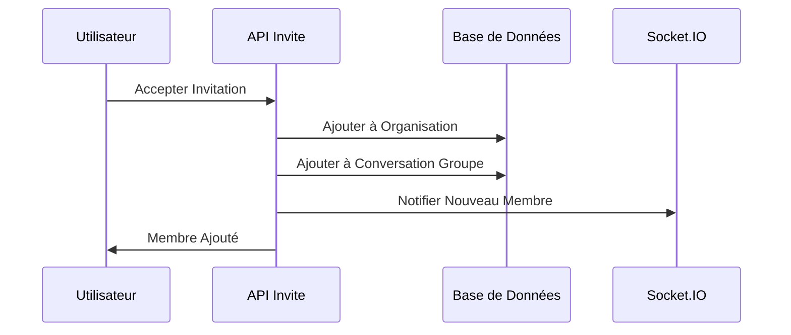
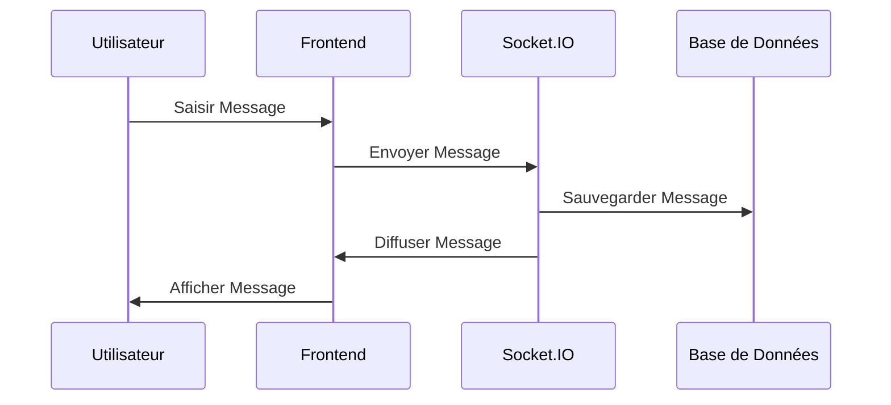

# Architecture du Système de Messagerie de Groupe

## Diagramme d'Architecture

```mermaid
graph TB
    subgraph "Frontend"
        A[Page Messages Groups] --> B[GroupConversationSidebar]
        A --> C[GroupConversationView]
        A --> D[EmptyGroupConversationState]
        A --> E[GroupConnectionStatus]

        B --> F[OrganizationInfo]
        C --> G[GroupMembersList]
        C --> H[WelcomeMessage]
        C --> I[MessageList]

        J[useGroupConversations Hook] --> A
        K[useSocket Hook] --> A
        L[useAuth Hook] --> A
    end

    subgraph "Backend APIs"
        M[/api/organizations/create] --> N[Création Conversation Groupe]
        O[/api/invite/[code]] --> P[Ajout Membre Conversation]
        Q[/api/organizations/[id]/group-conversation] --> R[Gestion Conversation]
        S[/api/organizations/[id]/group-conversation/sync-members] --> T[Synchronisation Membres]
    end

    subgraph "Base de Données"
        U[(Conversation)] --> V[type: GROUP]
        U --> W[organizationId]
        U --> X[title]

        Y[(ConversationMember)] --> Z[conversationId]
        Y --> AA[userId]
        Y --> BB[role: ADMIN/MEMBER]

        CC[(Organization)] --> DD[members]
        CC --> EE[organizationMembers]
    end

    subgraph "Temps Réel"
        FF[Socket.IO Server] --> GG[Gestion Messages]
        FF --> HH[Gestion Connexions]
        FF --> II[Gestion Rooms]
    end

    A --> M
    A --> O
    A --> Q
    A --> S
    A --> FF

    N --> U
    P --> Y
    R --> U
    T --> Y

    FF --> A
```

## Flux de Données

### 1. Création d'Organisation



### 2. Ajout de Membre



### 3. Envoi de Message



## Composants et Responsabilités

### Frontend Components

| Composant                  | Responsabilité            | Props                                            |
| -------------------------- | ------------------------- | ------------------------------------------------ |
| `MessagesGroupsPage`       | Page principale           | -                                                |
| `GroupConversationSidebar` | Liste des conversations   | `selectedConversationId`, `onConversationSelect` |
| `GroupConversationView`    | Interface de conversation | `conversationId`, `conversation`, `user`         |
| `GroupMembersList`         | Liste des membres         | `members`, `currentUserId`                       |
| `OrganizationInfo`         | Infos organisation        | -                                                |
| `GroupConnectionStatus`    | Statut connexion          | `isConnected`, `isConnecting`                    |
| `WelcomeMessage`           | Message de bienvenue      | `conversationId`                                 |

### Backend APIs

| Endpoint                                                  | Méthode   | Responsabilité                               |
| --------------------------------------------------------- | --------- | -------------------------------------------- |
| `/api/organizations/create`                               | POST      | Créer organisation + conversation groupe     |
| `/api/invite/[code]`                                      | GET/POST  | Accepter invitation + ajouter à conversation |
| `/api/organizations/[id]/group-conversation`              | GET/PATCH | Gérer conversation groupe                    |
| `/api/organizations/[id]/group-conversation/sync-members` | POST      | Synchroniser membres                         |

### Hooks Personnalisés

| Hook                    | Responsabilité               | Retour                                |
| ----------------------- | ---------------------------- | ------------------------------------- |
| `useGroupConversations` | Gestion conversations groupe | `conversations`, `isLoading`, `error` |
| `useSocket`             | Communication temps réel     | `sendMessage`, `isConnected`          |
| `useAuth`               | Authentification             | `user`, `checkAuth`                   |
| `useActiveOrganization` | Organisation active          | `activeOrganization`                  |

## Sécurité et Validation

### Vérifications d'Accès

- ✅ Utilisateur authentifié
- ✅ Membre de l'organisation
- ✅ Permissions de conversation
- ✅ Validation des données

### Gestion des Erreurs

- ✅ Retry automatique
- ✅ Messages d'erreur informatifs
- ✅ Fallback gracieux
- ✅ Logs détaillés

## Performance et Optimisation

### Stratégies d'Optimisation

- ✅ Chargement paresseux
- ✅ Mise en cache des données
- ✅ Synchronisation optimisée
- ✅ Pagination des messages
- ✅ Compression des données

### Monitoring

- ✅ Métriques de performance
- ✅ Surveillance connectivité
- ✅ Logs d'audit
- ✅ Alertes automatiques
