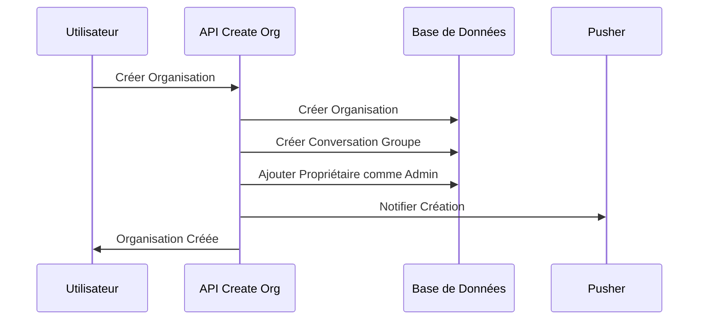
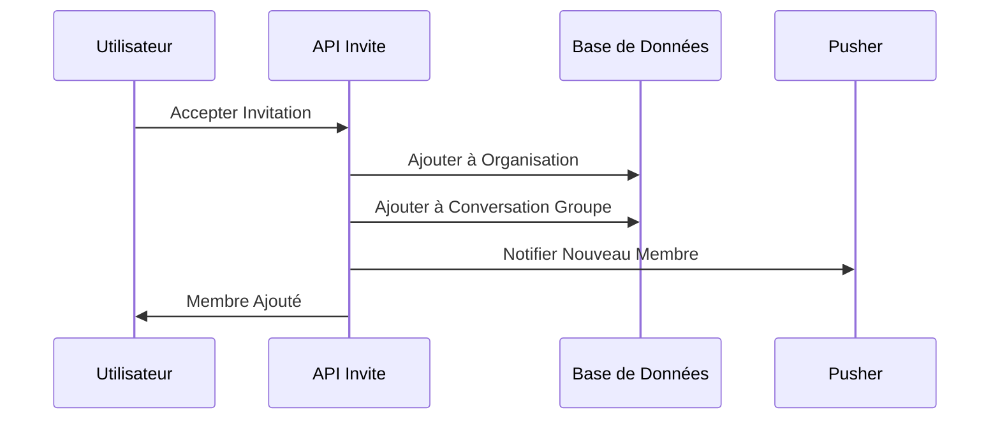
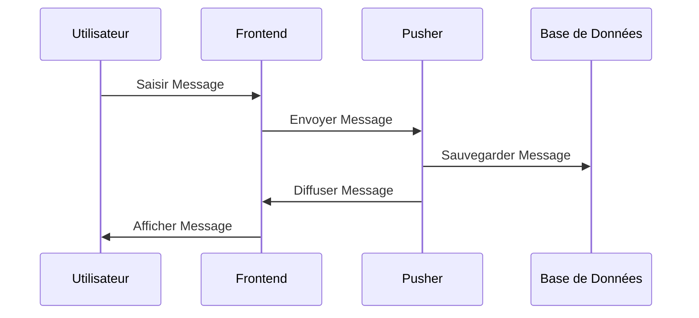
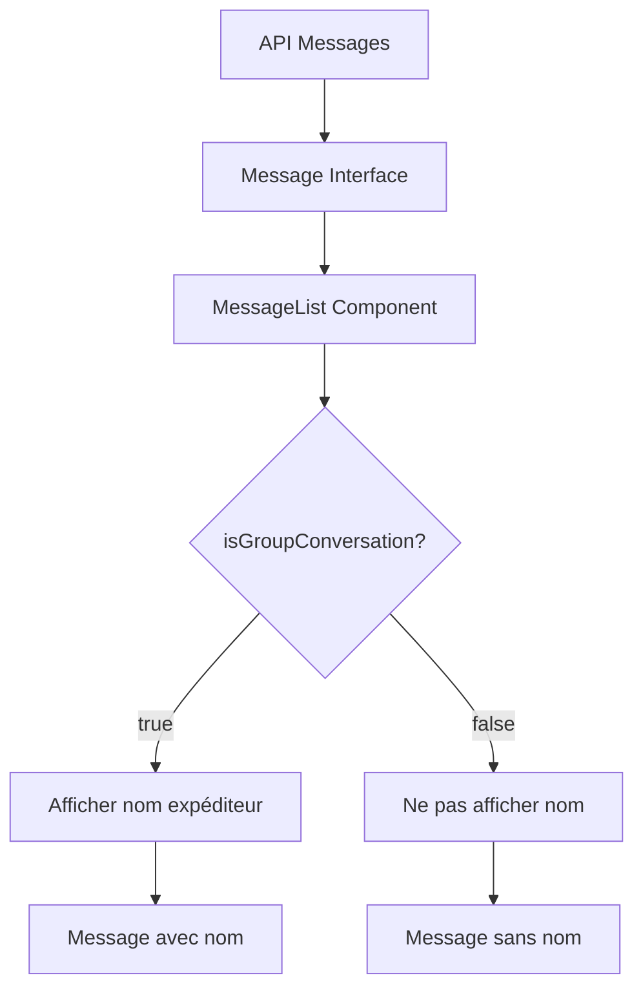

# Documentation Complète du Système de Messagerie - Teamify

## Table des Matières

1. [Vue d'ensemble](#vue-densemble)
2. [Système de Messagerie de Groupe](#système-de-messagerie-de-groupe)
3. [Architecture du Système](#architecture-du-système)
4. [Système de Messagerie en Temps Réel](#système-de-messagerie-en-temps-réel)
5. [Identification des Expéditeurs](#identification-des-expéditeurs)
6. [Modèle de Données](#modèle-de-données)
7. [Composants React](#composants-react)
8. [API REST](#api-rest)
9. [Sécurité et Performance](#sécurité-et-performance)
10. [Évolutions Futures](#évolutions-futures)

---

## Vue d'ensemble

Le système de messagerie de Teamify est une solution complète de communication en temps réel basée sur Pusher, intégrée dans une architecture Next.js moderne. Cette fonctionnalité permet aux utilisateurs de communiquer instantanément au sein d'organisations, de groupes d'événements, ou en conversations privées, offrant une expérience utilisateur fluide et réactive.

### Technologies Utilisées

- **Pusher** : Service de communication en temps réel
- **Next.js 14** : Framework React avec App Router
- **Prisma** : ORM pour la gestion de base de données
- **PostgreSQL** : Base de données relationnelle
- **TypeScript** : Typage statique pour la robustesse du code
- **Tailwind CSS** : Framework CSS pour l'interface utilisateur

---

## Système de Messagerie de Groupe

### Fonctionnalités

#### Création Automatique

- **Création automatique** : Une conversation de groupe est créée automatiquement lors de la création d'une organisation
- **Ajout automatique des membres** : Les nouveaux membres rejoignant l'organisation sont automatiquement ajoutés à la conversation de groupe
- **Synchronisation** : Les membres sont synchronisés automatiquement entre l'organisation et la conversation de groupe

#### Messagerie Temps Réel

- **Messages instantanés** : Communication en temps réel via Pusher
- **Interface responsive** : Optimisée pour mobile et desktop
- **Gestion des états** : Indicateurs de connexion et de statut

#### Gestion des Membres

- **Liste des membres** : Affichage de tous les participants avec leurs rôles
- **Rôles** : Distinction entre administrateurs et membres
- **Informations détaillées** : Nom, avatar, date d'adhésion

#### Interface Utilisateur

- **Design cohérent** : Même esthétique que la messagerie privée
- **Composants modulaires** : Architecture réutilisable et maintenable
- **Accessibilité** : Interface accessible et intuitive

### Composants Principaux

#### `GroupConversationSidebar`

- Affiche la liste des conversations de groupe
- Informations sur l'organisation active
- Recherche et filtrage des conversations

#### `GroupConversationView`

- Interface principale de conversation
- Zone de saisie de messages
- Gestion des messages en temps réel

#### `GroupMembersList`

- Liste des membres de la conversation
- Informations sur les rôles et statuts
- Interface modale pour les détails

#### `OrganizationInfo`

- Informations sur l'organisation active
- Nombre de membres et type d'organisation

### Hooks Personnalisés

#### `useGroupConversations`

- Gestion des conversations de groupe
- Synchronisation automatique des membres
- Mise à jour du titre de conversation

### APIs

#### `/api/organizations/[organizationId]/group-conversation`

- **GET** : Récupère ou crée la conversation de groupe
- **PATCH** : Met à jour le titre de la conversation

#### `/api/organizations/[organizationId]/group-conversation/sync-members`

- **POST** : Synchronise les membres de l'organisation avec la conversation

---

## Architecture du Système

### Diagramme d'Architecture

```mermaid
graph TB
    subgraph "Frontend"
        A[Page Messages Groups] --> B[GroupConversationSidebar]
        A --> C[GroupConversationView]
        A --> D[EmptyGroupConversationState]
        A --> E[GroupConnectionStatus]

        B --> F[OrganizationInfo]
        C --> G[GroupMembersList]
        C --> H[WelcomeMessage]
        C --> I[MessageList]

        J[useGroupConversations Hook] --> A
        K[usePusher Hook] --> A
        L[useAuth Hook] --> A
    end

    subgraph "Backend APIs"
        M[/api/organizations/create] --> N[Création Conversation Groupe]
        O[/api/invite/[code]] --> P[Ajout Membre Conversation]
        Q[/api/organizations/[id]/group-conversation] --> R[Gestion Conversation]
        S[/api/organizations/[id]/group-conversation/sync-members] --> T[Synchronisation Membres]
    end

    subgraph "Base de Données"
        U[(Conversation)] --> V[type: GROUP]
        U --> W[organizationId]
        U --> X[title]

        Y[(ConversationMember)] --> Z[conversationId]
        Y --> AA[userId]
        Y --> BB[role: ADMIN/MEMBER]

        CC[(Organization)] --> DD[members]
        CC --> EE[organizationMembers]
    end

    subgraph "Temps Réel"
        FF[Pusher Service] --> GG[Gestion Messages]
        FF --> HH[Gestion Connexions]
        FF --> II[Gestion Channels]
    end

    A --> M
    A --> O
    A --> Q
    A --> S
    A --> FF

    N --> U
    P --> Y
    R --> U
    T --> Y

    FF --> A
```

### Flux de Données

#### 1. Création d'Organisation



#### 2. Ajout de Membre



#### 3. Envoi de Message



### Composants et Responsabilités

#### Frontend Components

| Composant                  | Responsabilité            | Props                                            |
| -------------------------- | ------------------------- | ------------------------------------------------ |
| `MessagesGroupsPage`       | Page principale           | -                                                |
| `GroupConversationSidebar` | Liste des conversations   | `selectedConversationId`, `onConversationSelect` |
| `GroupConversationView`    | Interface de conversation | `conversationId`, `conversation`, `user`         |
| `GroupMembersList`         | Liste des membres         | `members`, `currentUserId`                       |
| `OrganizationInfo`         | Infos organisation        | -                                                |
| `GroupConnectionStatus`    | Statut connexion          | `isConnected`, `isConnecting`                    |
| `WelcomeMessage`           | Message de bienvenue      | `conversationId`                                 |

#### Backend APIs

| Endpoint                                                  | Méthode   | Responsabilité                               |
| --------------------------------------------------------- | --------- | -------------------------------------------- |
| `/api/organizations/create`                               | POST      | Créer organisation + conversation groupe     |
| `/api/invite/[code]`                                      | GET/POST  | Accepter invitation + ajouter à conversation |
| `/api/organizations/[id]/group-conversation`              | GET/PATCH | Gérer conversation groupe                    |
| `/api/organizations/[id]/group-conversation/sync-members` | POST      | Synchroniser membres                         |

#### Hooks Personnalisés

| Hook                    | Responsabilité               | Retour                                |
| ----------------------- | ---------------------------- | ------------------------------------- |
| `useGroupConversations` | Gestion conversations groupe | `conversations`, `isLoading`, `error` |
| `usePusher`             | Communication temps réel     | `sendMessage`, `isConnected`          |
| `useAuth`               | Authentification             | `user`, `checkAuth`                   |
| `useActiveOrganization` | Organisation active          | `activeOrganization`                  |

---

## Système de Messagerie en Temps Réel

### Architecture en Couches

Le système de messagerie suit une architecture en couches bien définie :

1. **Couche Présentation** : Composants React pour l'interface utilisateur
2. **Couche Logique Métier** : Hooks personnalisés et gestion d'état
3. **Couche API** : Endpoints REST pour les opérations CRUD
4. **Couche Temps Réel** : Service Pusher pour la communication instantanée
5. **Couche Données** : Base de données PostgreSQL avec Prisma ORM

### Service Pusher

#### Configuration et Initialisation

```typescript
// Configuration côté serveur
export const pusherServer = new Pusher({
  appId: process.env.PUSHER_APP_ID!,
  key: process.env.PUSHER_KEY!,
  secret: process.env.PUSHER_SECRET!,
  cluster: process.env.PUSHER_CLUSTER!,
  useTLS: true,
});

// Configuration côté client
export function getPusherClient(): PusherClient {
  if (typeof window === "undefined") {
    throw new Error("Pusher client ne peut être utilisé que côté client");
  }

  if (!pusherClient) {
    const key = process.env.NEXT_PUBLIC_PUSHER_KEY;
    const cluster = process.env.NEXT_PUBLIC_PUSHER_CLUSTER;

    if (!key || !cluster) {
      throw new Error("Variables d'environnement Pusher manquantes");
    }

    pusherClient = new PusherClient(key, {
      cluster,
      useTLS: true,
    });
  }
  return pusherClient;
}
```

#### Authentification et Sécurité

Le système implémente une authentification robuste avec Pusher :

1. **Variables d'Environnement** : Configuration sécurisée des clés Pusher
2. **Validation Côté Client** : Vérification de la disponibilité des variables
3. **Gestion des Erreurs** : Gestion des erreurs de connexion et d'authentification

#### Gestion des Connexions

Lorsqu'un utilisateur se connecte :

1. **Initialisation du Client** : Création du client Pusher avec les bonnes variables
2. **Connexion aux Canaux** : Souscription aux canaux de conversation spécifiques
3. **Gestion des États** : Suivi de l'état de connexion et des erreurs

#### Événements Pusher

##### Événements Client vers Serveur

- **`new-message`** : Envoi d'un nouveau message
- **`message-read`** : Marquer un message comme lu
- **`conversation-joined`** : Rejoindre une conversation

##### Événements Serveur vers Client

- **`new-message`** : Nouveau message reçu
- **`message-read`** : Confirmation de lecture d'un message
- **`conversation-joined`** : Confirmation de participation à une conversation
- **`error`** : Gestion des erreurs

---

## Identification des Expéditeurs

### Problème Résolu

Dans les conversations de groupe, il était impossible d'identifier qui avait envoyé chaque message, car seul le contenu du message était affiché.

### Solution Implémentée

#### 1. Modification du Composant MessageList

**Fichier :** `src/components/dashboard/messaging/message-list.tsx`

- **Nouvelle prop :** `isGroupConversation?: boolean`
- **Fonction ajoutée :** `getSenderDisplayName()` pour formater le nom de l'expéditeur
- **Affichage conditionnel :** Le nom de l'expéditeur s'affiche uniquement pour les conversations de groupe et pour les messages des autres utilisateurs

#### 2. Mise à Jour des Composants Utilisateurs

**GroupConversationView :**

```typescript
<MessageList
  messages={messages}
  currentUserId={user?.uid}
  isLoading={messagesLoading}
  onDeleteMessage={deleteMessage}
  isGroupConversation={true} // Toujours true pour les conversations de groupe
/>
```

**ConversationView :**

```typescript
<MessageList
  messages={messages}
  currentUserId={user?.uid}
  isLoading={messagesLoading}
  onDeleteMessage={deleteMessage}
  isGroupConversation={conversation?.type === "GROUP"} // Détection automatique
/>
```

### Flux de Données



### Structure des Données

#### Interface Message (déjà existante)

```typescript
interface Message {
  id: string;
  conversationId: string;
  senderId: string;
  content: string;
  attachments?: any;
  createdAt: Date;
  sender: {
    uid: string;
    firstname: string | null;
    lastname: string | null;
    profileImage: string | null;
  };
}
```

#### Fonction de Formatage

```typescript
const getSenderDisplayName = (message: Message) => {
  if (!message.sender) return "Utilisateur";

  const { firstname, lastname } = message.sender;
  const fullName = `${firstname || ""} ${lastname || ""}`.trim();

  return fullName || "Utilisateur";
};
```

### Comportement

#### Conversations de Groupe

- ✅ Affiche le nom de l'expéditeur pour les messages des autres utilisateurs
- ✅ N'affiche pas le nom pour ses propres messages (évite la redondance)
- ✅ Utilise le nom complet (prénom + nom) ou "Utilisateur" par défaut

#### Conversations Privées

- ✅ N'affiche pas le nom de l'expéditeur (pas nécessaire avec seulement 2 personnes)
- ✅ Maintient l'affichage existant

---

## Modèle de Données

### Schéma de Base de Données

Le système de messagerie repose sur quatre modèles principaux dans la base de données :

#### 1. Conversation

```typescript
model Conversation {
  id             String           @id @default(cuid())
  type           ConversationType // PRIVATE ou GROUP
  title          String?         // Titre optionnel pour les groupes
  organizationId Int?            // ID de l'organisation (optionnel)
  createdAt      DateTime        @default(now())

  members      ConversationMember[]
  messages     Message[]
  organization Organization?     @relation(fields: [organizationId], references: [id])
}
```

#### 2. ConversationMember

```typescript
model ConversationMember {
  id             String     @id @default(cuid())
  conversationId String
  userId         String
  role           MemberRole // MEMBER ou ADMIN
  joinedAt       DateTime   @default(now())

  conversation Conversation @relation(fields: [conversationId], references: [id])
  user         User         @relation(fields: [userId], references: [uid])

  @@unique([conversationId, userId])
}
```

#### 3. Message

```typescript
model Message {
  id             String   @id @default(cuid())
  conversationId String
  senderId       String
  content        String
  attachments    Json?    // Support pour les pièces jointes
  createdAt      DateTime @default(now())

  conversation Conversation     @relation(fields: [conversationId], references: [id])
  sender       User             @relation(fields: [senderId], references: [uid])
  receipts     MessageReceipt[]

  @@index([conversationId, createdAt]) // Index pour optimiser les requêtes
}
```

#### 4. MessageReceipt

```typescript
model MessageReceipt {
  id        String        @id @default(cuid())
  messageId String
  userId    String
  status    ReceiptStatus // DELIVERED ou READ
  timestamp DateTime      @default(now())

  message Message @relation(fields: [messageId], references: [id])
  user    User    @relation(fields: [userId], references: [uid])

  @@unique([messageId, userId])
}
```

### Types et Enums

Le système utilise plusieurs enums pour maintenir la cohérence des données :

- **ConversationType** : PRIVATE, GROUP
- **MemberRole** : MEMBER, ADMIN
- **ReceiptStatus** : DELIVERED, READ

---

## Composants React

### Architecture des Composants

Le système de messagerie utilise une architecture de composants modulaire :

```
messaging/
├── chat-interface.tsx          # Interface principale
├── conversation-sidebar.tsx    # Liste des conversations
├── conversation-view.tsx       # Vue d'une conversation
├── message-list.tsx           # Liste des messages
└── create-conversation-dialog.tsx # Dialog de création
```

### Hooks Personnalisés

#### usePusher Hook

Le hook `usePusher` centralise toute la logique de communication Pusher :

```typescript
export const usePusher = (options: UsePusherOptions = {}) => {
  const {
    autoConnect = false,
    onMessage,
    onMessageRead,
    onConversationJoined,
    onError,
  } = options;

  // Gestion de l'état de connexion
  const [isConnected, setIsConnected] = useState(false);
  const [isConnecting, setIsConnecting] = useState(false);
  const [error, setError] = useState<string | null>(null);
  const [currentChannelName, setCurrentChannelName] = useState<string | null>(
    null
  );

  // Fonctions principales
  const connectToChannel = useCallback((channelName: string) => {
    /* ... */
  });
  const disconnect = useCallback(() => {
    /* ... */
  });

  return {
    isConnected,
    isConnecting,
    error,
    connectToChannel,
    disconnect,
    currentChannel: currentChannelName,
  };
};
```

#### useMessages Hook

Gère l'état local des messages avec optimisations :

```typescript
export const useMessages = (options: UseMessagesOptions = {}) => {
  const [messages, setMessages] = useState<Message[]>([]);
  const [isLoading, setIsLoading] = useState(false);
  const [error, setError] = useState<string | null>(null);

  // Gestion des messages optimistes
  const addMessage = useCallback((message: Message) => {
    setMessages((prev) => {
      // Logique de remplacement des messages optimistes
      // par les vrais messages du serveur
    });
  }, []);

  return {
    messages,
    isLoading,
    error,
    fetchMessages,
    addMessage,
    updateMessage,
    removeMessage,
  };
};
```

#### useConversations Hook

Gère les conversations avec toutes les opérations CRUD :

```typescript
export const useConversations = (options: UseConversationsOptions = {}) => {
  // État des conversations
  const [conversations, setConversations] = useState<Conversation[]>([]);

  // Opérations CRUD
  const fetchConversations = useCallback(() => {
    /* ... */
  });
  const createConversation = useCallback(() => {
    /* ... */
  });
  const addMemberToConversation = useCallback(() => {
    /* ... */
  });
  const removeMemberFromConversation = useCallback(() => {
    /* ... */
  });
  const updateConversation = useCallback(() => {
    /* ... */
  });
  const deleteConversation = useCallback(() => {
    /* ... */
  });

  return {
    conversations,
    isLoading,
    error,
    fetchConversations,
    createConversation,
    addMemberToConversation,
    removeMemberFromConversation,
    updateConversation,
    deleteConversation,
    fetchMessages,
  };
};
```

---

## API REST

### Endpoints de Conversations

#### GET /api/conversations

Récupère toutes les conversations de l'utilisateur connecté :

```typescript
export async function GET(req: NextRequest) {
  const user = await getCurrentUser();
  if (!user) {
    return NextResponse.json({ error: "Non authentifié" }, { status: 401 });
  }

  const conversations = await prisma.conversation.findMany({
    where: {
      members: {
        some: { userId: user.uid },
      },
    },
    include: {
      members: {
        include: {
          user: {
            select: {
              uid: true,
              firstname: true,
              lastname: true,
              profileImage: true,
            },
          },
        },
      },
      messages: {
        take: 1,
        orderBy: { createdAt: "desc" },
        include: {
          sender: {
            select: {
              firstname: true,
              lastname: true,
            },
          },
        },
      },
    },
    orderBy: { createdAt: "desc" },
  });

  return NextResponse.json({ conversations: formattedConversations });
}
```

#### POST /api/conversations

Crée une nouvelle conversation :

```typescript
export async function POST(req: NextRequest) {
  const user = await getCurrentUser();
  const { type, title, memberIds, organizationId } = await req.json();

  // Validation des données
  if (!type || !memberIds || !Array.isArray(memberIds)) {
    return NextResponse.json(
      { error: "Type et membres requis" },
      { status: 400 }
    );
  }

  // Vérification que tous les membres existent
  const existingUsers = await prisma.user.findMany({
    where: { uid: { in: memberIds } },
    select: { uid: true },
  });

  if (existingUsers.length !== memberIds.length) {
    return NextResponse.json(
      { error: "Un ou plusieurs utilisateurs n'existent pas" },
      { status: 400 }
    );
  }

  // Création de la conversation
  const conversation = await prisma.conversation.create({
    data: {
      type,
      title: title || null,
      organizationId: organizationId ? parseInt(organizationId) : null,
      members: {
        create: memberIds.map((memberId: string) => ({
          userId: memberId,
          role: memberId === user.uid ? "ADMIN" : "MEMBER",
        })),
      },
    },
    include: {
      members: {
        include: {
          user: {
            select: {
              uid: true,
              firstname: true,
              lastname: true,
              profileImage: true,
            },
          },
        },
      },
    },
  });

  return NextResponse.json(conversation, { status: 201 });
}
```

### Endpoints de Messages

#### GET /api/conversations/[conversationId]/messages

Récupère les messages d'une conversation :

```typescript
export async function GET(
  request: NextRequest,
  { params }: { params: Promise<{ conversationId: string }> }
) {
  const { conversationId } = await params;
  const user = await getCurrentUser();

  // Vérification de l'appartenance à la conversation
  const membership = await prisma.conversationMember.findUnique({
    where: {
      conversationId_userId: {
        conversationId,
        userId: user.uid,
      },
    },
  });

  if (!membership) {
    return NextResponse.json(
      { error: "Accès refusé à cette conversation" },
      { status: 403 }
    );
  }

  // Récupération des messages
  const messages = await prisma.message.findMany({
    where: { conversationId },
    include: {
      sender: {
        select: {
          uid: true,
          firstname: true,
          lastname: true,
          profileImage: true,
        },
      },
    },
    orderBy: { createdAt: "asc" },
  });

  return NextResponse.json({ messages });
}
```

#### POST /api/conversations/[conversationId]/messages

Crée un nouveau message :

```typescript
export async function POST(
  request: NextRequest,
  { params }: { params: Promise<{ conversationId: string }> }
) {
  const { conversationId } = await params;
  const { content, attachments } = await request.json();
  const user = await getCurrentUser();

  // Validation du contenu
  if (!content || !content.trim()) {
    return NextResponse.json(
      { error: "Le contenu du message est requis" },
      { status: 400 }
    );
  }

  // Vérification de l'appartenance à la conversation
  const membership = await prisma.conversationMember.findUnique({
    where: {
      conversationId_userId: {
        conversationId,
        userId: user.uid,
      },
    },
  });

  if (!membership) {
    return NextResponse.json(
      { error: "Accès refusé à cette conversation" },
      { status: 403 }
    );
  }

  // Création du message
  const message = await prisma.message.create({
    data: {
      conversationId,
      senderId: user.uid,
      content: content.trim(),
      attachments: attachments || null,
    },
    include: {
      sender: {
        select: {
          uid: true,
          firstname: true,
          lastname: true,
          profileImage: true,
        },
      },
    },
  });

  return NextResponse.json(message);
}
```

#### DELETE /api/conversations/[conversationId]/messages/[messageId]

Supprime un message :

```typescript
export async function DELETE(
  request: NextRequest,
  { params }: { params: Promise<{ conversationId: string; messageId: string }> }
) {
  const { conversationId, messageId } = await params;
  const user = await getCurrentUser();

  // Vérification de l'authentification
  if (!user) {
    return NextResponse.json({ error: "Non authentifié" }, { status: 401 });
  }

  // Vérification de l'appartenance à la conversation
  const membership = await prisma.conversationMember.findUnique({
    where: {
      conversationId_userId: {
        conversationId,
        userId: user.uid,
      },
    },
  });

  if (!membership) {
    return NextResponse.json(
      { error: "Accès refusé à cette conversation" },
      { status: 403 }
    );
  }

  // Vérification que le message existe et appartient à l'utilisateur
  const message = await prisma.message.findUnique({
    where: {
      id: messageId,
      conversationId,
    },
  });

  if (!message) {
    return NextResponse.json({ error: "Message non trouvé" }, { status: 404 });
  }

  if (message.senderId !== user.uid) {
    return NextResponse.json(
      { error: "Vous ne pouvez supprimer que vos propres messages" },
      { status: 403 }
    );
  }

  // Suppression du message
  await prisma.message.delete({
    where: {
      id: messageId,
    },
  });

  return NextResponse.json({ success: true });
}
```

---

## Sécurité et Performance

### Sécurité

#### Vérifications d'Accès

- ✅ Utilisateur authentifié
- ✅ Membre de l'organisation
- ✅ Permissions de conversation
- ✅ Validation des données

#### Authentification

- **JWT Tokens** : Authentification basée sur des tokens JWT
- **Validation Serveur** : Vérification systématique des tokens
- **Sessions** : Gestion des sessions utilisateur

#### Autorisation

- **Vérification d'Appartenance** : Contrôle d'accès aux conversations
- **Validation des Données** : Sanitisation des entrées utilisateur
- **Rate Limiting** : Protection contre les abus

#### Chiffrement

- **HTTPS/WSS** : Communication chiffrée
- **Validation CORS** : Configuration sécurisée des origines
- **Sanitisation** : Nettoyage des données utilisateur

### Performance

#### Stratégies d'Optimisation

- ✅ Chargement paresseux
- ✅ Mise en cache des données
- ✅ Synchronisation optimisée
- ✅ Pagination des messages
- ✅ Compression des données

#### Messages Optimistes

Le système implémente des messages optimistes pour améliorer l'expérience utilisateur :

```typescript
const addMessage = useCallback((message: Message) => {
  setMessages((prev) => {
    // Si c'est un message optimiste (ID commence par "temp_"), l'ajouter
    if (message.id.startsWith("temp_")) {
      return [...prev, message];
    }

    // Si c'est un message du serveur, remplacer le message optimiste correspondant
    const hasOptimisticMessage = prev.some(
      (msg) =>
        msg.id.startsWith("temp_") &&
        msg.conversationId === message.conversationId &&
        msg.content === message.content
    );

    if (hasOptimisticMessage) {
      return prev.map((msg) =>
        msg.id.startsWith("temp_") &&
        msg.conversationId === message.conversationId &&
        msg.content === message.content
          ? message
          : msg
      );
    }

    return [...prev, message];
  });
}, []);
```

#### Gestion de l'État

- **État Local** : Gestion optimisée avec `useState` et `useCallback`
- **Mémoisation** : Utilisation de `useMemo` pour les calculs coûteux
- **Cleanup** : Nettoyage automatique des listeners et connexions

#### Scroll Automatique

```typescript
useEffect(() => {
  if (scrollAreaRef.current) {
    const scrollElement = scrollAreaRef.current.querySelector(
      "[data-radix-scroll-area-viewport]"
    );
    if (scrollElement) {
      setTimeout(() => {
        scrollElement.scrollTop = scrollElement.scrollHeight;
      }, 0);
    }
  }
}, [messages]);
```

### Gestion des Erreurs

#### Types d'Erreurs

1. **Erreurs de Connexion** : Problèmes de réseau ou serveur
2. **Erreurs d'Authentification** : Token invalide ou expiré
3. **Erreurs de Validation** : Données invalides
4. **Erreurs d'Accès** : Permissions insuffisantes

#### Stratégies de Gestion

```typescript
// Gestion des erreurs Pusher
pusherClient.connection.bind("error", (error: any) => {
  console.error("❌ Erreur de connexion Pusher:", error);
  setError(`Erreur de connexion: ${error.message || error}`);
  setIsConnected(false);
  setIsConnecting(false);
  onErrorRef.current?.(error);
});

// Gestion des erreurs API
try {
  const response = await fetch("/api/conversations");
  if (!response.ok) {
    throw new Error(`Erreur ${response.status}: ${response.statusText}`);
  }
} catch (err) {
  console.error("Erreur lors de la récupération des conversations:", err);
  setError(err instanceof Error ? err.message : "Erreur inconnue");
}
```

### Monitoring

- ✅ Métriques de performance
- ✅ Surveillance connectivité
- ✅ Logs d'audit
- ✅ Alertes automatiques

---

## Évolutions Futures

### Fonctionnalités Prévues

#### Messagerie de Groupe

- [ ] Messages avec pièces jointes
- [ ] Réactions aux messages
- [ ] Notifications push
- [ ] Historique des messages
- [ ] Modération des conversations
- [ ] Intégration avec les événements

#### Système Temps Réel

- [ ] Notifications Push : Intégration avec les notifications navigateur
- [ ] Messages Éphémères : Messages qui s'effacent automatiquement
- [ ] Réactions : Système de réactions aux messages
- [ ] Threads : Conversations en fil de discussion
- [ ] Recherche : Recherche dans les messages
- [ ] Mentions : Système de mentions d'utilisateurs
- [ ] Fichiers : Upload et partage de fichiers
- [ ] Messages Vocaux : Enregistrement et envoi de messages vocaux

### Améliorations Techniques

#### Messagerie de Groupe

- [ ] Pagination des messages
- [ ] Compression des données
- [ ] Optimisation des requêtes
- [ ] Tests automatisés
- [ ] Documentation API

#### Système Temps Réel

- [ ] Pagination : Chargement progressif des messages
- [ ] Cache : Mise en cache des conversations fréquentes
- [ ] Compression : Compression des messages volumineux
- [ ] CDN : Distribution des assets statiques
- [ ] Monitoring : Surveillance des performances en temps réel

---

## Correction du Problème de Connexion Pusher

### Problème Identifié

Le système de messagerie rencontrait un problème en production où l'input de messagerie restait désactivé malgré l'affichage du statut "connecté".

### Cause Racine

Le problème était dans la logique de connexion des composants `ConversationView` et `GroupConversationView` :

```typescript
// ❌ LOGIQUE INCORRECTE (cercle vicieux)
useEffect(() => {
  if (conversationId && isConnected) {
    // ← Problème ici !
    connectToChannel(`conversation-${conversationId}`);
  }
}, [conversationId, isConnected, connectToChannel, disconnect]);
```

**Pourquoi c'était incorrect :**

1. `isConnected` est `false` au début
2. On ne peut pas se connecter tant que `isConnected` n'est pas `true`
3. Mais `isConnected` ne devient `true` que si on se connecte au canal
4. **Cercle vicieux : impossible de se connecter !**

### Solution Appliquée

Correction de la logique de connexion dans les deux composants :

```typescript
// ✅ LOGIQUE CORRIGÉE
useEffect(() => {
  if (conversationId) {
    const channelName = `conversation-${conversationId}`;
    console.log(`🔌 Connexion à la conversation: ${channelName}`);
    connectToChannel(channelName);
  } else {
    console.log("🔌 Aucune conversation sélectionnée, déconnexion");
    disconnect();
  }

  return () => {
    if (conversationId) {
      console.log("🔌 Nettoyage de la connexion");
      disconnect();
    }
  };
}, [conversationId, connectToChannel, disconnect]);
```

### Fichiers Modifiés

1. ✅ `src/components/dashboard/messaging/conversation-view.tsx`
2. ✅ `src/components/dashboard/messaging/groups/group-conversation-view.tsx`

### Résultat

✅ **Problème résolu** : L'input de messagerie est maintenant activé en production
✅ **Connexion automatique** : Les canaux de conversation se connectent automatiquement
✅ **Gestion des états** : Les états de connexion sont correctement gérés
✅ **Performance optimisée** : Plus de dépendances circulaires

---

## Conclusion

Le système de messagerie de Teamify représente une solution complète et moderne pour la communication en temps réel. Son architecture modulaire, sa robustesse et ses optimisations en font un système évolutif capable de s'adapter aux besoins croissants de l'application.

L'utilisation de Pusher pour la communication temps réel, combinée à une API REST pour la persistance des données, offre le meilleur des deux mondes : performance et fiabilité. L'architecture en composants React facilite la maintenance et l'évolution du code, tandis que TypeScript assure la robustesse du système.

Cette implémentation constitue une base solide pour développer des fonctionnalités de communication avancées et répondre aux besoins futurs de l'application Teamify.

---

## Support

Pour toute question ou problème concernant le système de messagerie, consultez :

- La documentation des composants
- Les logs de l'application
- L'équipe de développement
